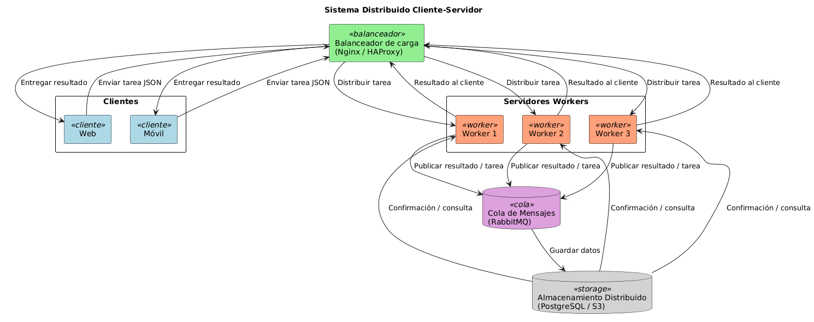

# Sistema Distribuido Cliente-Servidor

## Descripción
Este proyecto es una implementación simplificada de un sistema distribuido usando sockets en Python.  
El objetivo es simular la arquitectura Cliente-Servidor con múltiples *workers* que procesan tareas enviadas por los clientes.

**Características:**
- Clientes (Web y Móvil) que envían tareas JSON.
- Servidor con **pool de hilos** (workers) que procesan tareas en paralelo.
- Tareas simples: invertir texto, calcular promedio de números, contar caracteres.
- Diagrama del sistema mostrando balanceador, workers, cola de mensajes y almacenamiento distribuido.

---

## Arquitectura

Se utilizó el siguiente diseño (diagrama incluido):

- **Clientes:** web y móvil.
- **Balanceador de carga:** Nginx / HAProxy (simulado en el diagrama).
- **Servidores Workers:** cada hilo del servidor representa un worker.
- **Cola de mensajes:** RabbitMQ (simulado en el diagrama).
- **Almacenamiento distribuido:** PostgreSQL / S3 (simulado en el diagrama).

### Flujo
1. El cliente envía una tarea JSON al servidor.
2. El servidor recibe la tarea y la asigna a un worker (hilo).
3. El worker procesa la tarea y devuelve el resultado.
4. Se simula la persistencia en un almacenamiento distribuido mediante el flujo mostrado en el diagrama.

**Diagrama:** 


---

## Requisitos

- Python 3.x
- No requiere librerías externas (solo `socket` y `json`, incluidos en la librería estándar).

---

## Uso

### 1. Iniciar servidor
```bash
python server.py
```

---

### 2. Ejecutar cliente
```bash
python client.py
```

---

### Se mostrará un menú para seleccionar tareas:

Invertir texto

Calcular promedio de números

Contar caracteres en un texto

Salir

Ingresar los datos solicitados y ver la respuesta del servidor.

### Notas

Cada hilo del servidor representa un worker que procesa tareas en paralelo.

La arquitectura distribuida está simulada; la cola de mensajes y el almacenamiento se representan en el diagrama para fines educativos.

El proyecto demuestra el flujo de un sistema distribuido simple usando sockets y hilos en Python.

Para futuras mejoras se podría agregar RabbitMQ real, PostgreSQL o S3, y un balanceador físico como Nginx o HAProxy.

